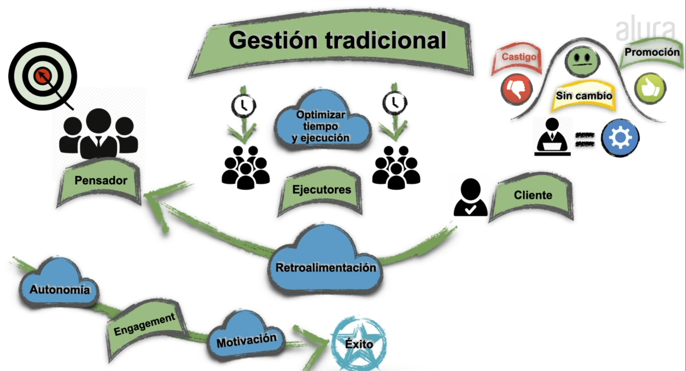

- Objetivos:
1. Entienda la diferencia entre la Gestión Tradicional y la Gestión Ágil
2. Conozca el concepto VUCA (Volatility, Uncertainty, Complexity, Ambiguity)
3. Aprenda por qué Motivación y Liderazgo son esenciales en la Gestión Ágil
4. Sepa de la importancia de la mejora continua para un proceso ágil

# Gestión tradicional

- Características comunes de gestión tradicional:
1. Planificación exhaustiva: Se realiza una planificación detallada y completa al comienzo del proyecto, donde se definen todos los requisitos y actividades necesarias.

2. Estructura jerárquica: Existe una jerarquía clara de autoridad y responsabilidades, con roles y funciones bien definidos.

3. Control y seguimiento: Se establecen mecanismos de control para monitorear el progreso del proyecto, y se toman medidas correctivas si hay desviaciones con respecto al plan.

4. Entrega al final del proyecto: El producto o resultado final se entrega una vez que todas las etapas y actividades se han completado de acuerdo con el plan.

5. Cambios controlados: Los cambios en el alcance, los requisitos o la planificación generalmente requieren un proceso formal de solicitud, aprobación y gestión del cambio.

## Como mejorar la gestión a diario

|Dont's| Significado|
|-----|------------|
|Micromanagement| querer estar involucrados en cada detalle, falta de confianza en el equipo |
|Top-down | que una sola persona decida sin ver lo que los demas pueden aportar |
|  buscar culpables  | buscar culpables en lugar de enfocarse en resolver problemas |
| Sin empatía | hay que recordar que trabajamos con personas,ponerse en el lugar del otro |
|Mucho silencio| juntas con mucho silencio, idicador de que algo no esta bien |
| Hacer cosas sin cuestionarlas| |
|Fallas de comunicacion| |
Ego y Brilliant jerks| personas sobresalientes pero que generan ambientes negativos |
|Burnout| Desgaste fisico o mental |

|Do's|
|----|
|Confía primero|
|Sé líder, no un jefe|
|Enfocate en resolver, no en culpar|
|Ponte en el lugar del otro|
|Sé transparente|
| Busca interactuar|
|Pregunta, escucha y conversa|
|Busca gente para hacer equipo|
|Haz 1-on-1 cada mes, como minimo|

La gestion tradicional funciono por mucho tiempo, pero al dia de hoy da señales de que esta empezando a ser menos efectiva, esta relacionada con un ambiente de baja autonomia, bajo engagement y poca motivación, esto tiene un impacto directo en su desempeño a la hora de llevar a cabo el proyecto.

## VUCA - (Volatility, Uncertainty, Complexity, Ambiguity)

- Volátil: algo que hoy se da por hecho puede ser diferente mañana.
- Incierto: hay muchas dudas para lograr resolver los problemas.
- Complejo: la solución no tiene necesariamente una estructura clara.
- Ambiguo: lo que funciona en cierto contexto puede ser inútil en otro similar.

Entornos en donde el dinamismo es crucial, entorno que cambia todo el tiempo y necesitamos adaptarnos de manera rapido.

Una función que funciona en un contexto no necesariamiente funciona en otro.

En un mundo VUCA donde las cosas cambian rápidamente, el principal valor es el conocimiento.Por ello, la principal habilidad es el aprendizaje.

El primer paso para mejorar los niveles de confianza dentro de una organización es basarons en 3 pilares: dar autonomía, tener propósito y volverse experto.

- Dar autonomía: puedo hacer las cosas de la mejor manera que considero sea la mejor.
- Tener propósito: todo lo que hago tiene un claro propósito con el que estoy de acuerdo.
- Volverse experto: la empresa me da espacio para mejorar en lo que más gusta hacer.

## Liderazgo y motivación

En un ambiente ágil, el liderazgo emerge naturalmente entre las personas, en paralelo a las habilidades mostradas para aquella posición y tambien dentro de ese momento.

además, el liderazgo es situacional, es decir que funciona en un contexto específico y no es fijo.

- Liderazgo situacional: ocurre cuando emerge de acuerdo al contexto, en una situación dada, una persona puede ser líder;en un contexto deltro del mismo equipo, puede ser otra persona.

## Empoderar y delegar
### Delegation Poker
Es una práctica incluida en el model ode liderazgo ágil management 3.0, su objetivo es clarificar quien es responsable de que cosa y hasta que nivel, a la ves se aumenta la implicación de los empleados.
Esta herramienta tiene 7 niveles:
1. Ordenar: hablar, comunicar una decision
2. Vender: comunicar la decision con mas detalles, convencer porque se tomo esa decision.
3. Consultar: se pide la opinion de los trabajadores y el gestor toma la decision final.
4. Consensuar: hacer una reunior para hablar todos, todos decidimos.
5. Aconsejar: El poder esta del lado de los ejecutores, pero el gestor los acompaña.
6. Informar: informarle al gestor la deicion, el equipo decide y le notifican al gestor.
7. Delegación completa: Se asume que la decision es completamente del equipo, el gestor confia plenamente en ellos.

El liderazgo es demasiado importante para estar contenido en una sola persona

El secreto de un buen proceso de toma de decisión se basa justamente en encontrar el equilibrio respecto a ese conocimiento. Delegation Poker es una forma de mapear las decisiones y el nivel de empoderamiento dentro de las organizaciones.

## Retroalimentación
La idea detras de dar retroalimentación siempre tiene que ver con mejorar
la retroalimentacion requiere estar compuesta de:
- Contextualizar: muestra el escenario para la persona, mientras que la exposición deja clara la situación donde aquello ocurrió para que pueda recordar ese momento. 
- El valor de la mejora deja visible lo que se gana al corregir aquel comportamiento.
- Finalmente, las preguntas poderosas buscan la reflexión sobre la situación.

Es importante que el feedback sea positivo

## Conocimiento

La retroalimentación genera conocimiento y logra el crecimiento de la persona, haciendo que salga de una etapa de habilidad inconsciente y logrando que sea consciente de ella, con lo que será capaz de adquirirla.

## Mejoras

### Kaizen y Kaikaki
Kaizen involucra cambios pequeños realizados de forma incremental a lo largo del tiempo, mientras que Kaikaki requiere uno grande hehco una sola vez.

### Mejora continua de procesos (Kaizen)
Identifica un pequeño proceso de tu día a día que te genera incomodidad y crees que pueda ser optimizado de alguna manera. Puede ser algo dentro de tu vida profesional o personal. Cámbialo para que pueda ser mejorado.

## Scrum y Kanban

[These 3 Management Styles Belong in the past](https://www.forbes.com/sites/worldeconomicforum/2016/02/03/these-3-management-styles-belong-in-the-past/?sh=4ccd2b542a18)
